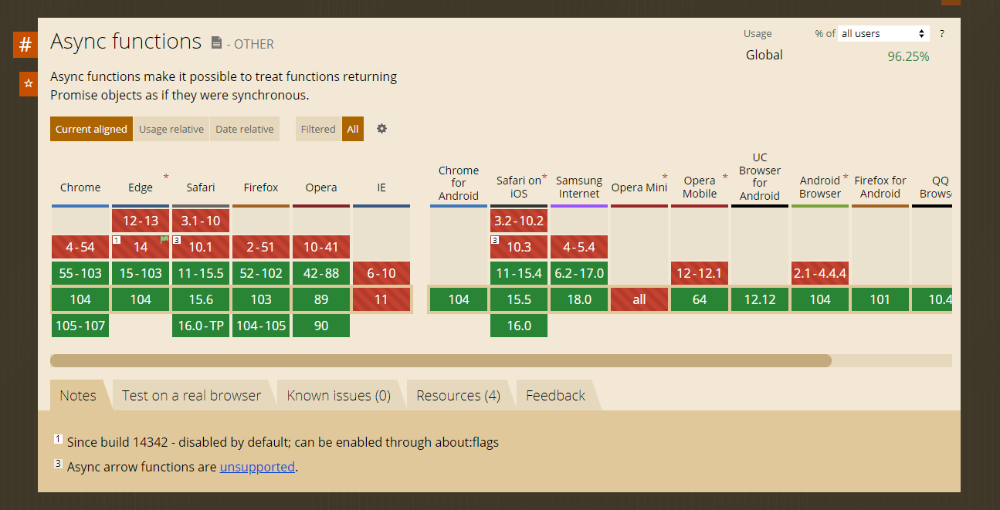

# Curso de ECMAScript Historia y Versiones de JavaScript

<h2>Contenido</h2>

- [Historia de Javascript: ¿Qué es ECMAScript?](#historia-de-javascript-¿qué-es-ecmascript)
- [¿Qué es el TC39?](#¿qué-es-el-tc39)
- [Configurando Nuestras Herramientas](#configurando-nuestras-herramientas)
- [ES6: let y const, y arrow functions](#es6-let-y-const-y-arrow-functions)
- [ES6: Parámetros por Defecto](#es6-parámetros-por-defecto)
- [ES6: Asignación de destructuración](#es6-asignación-de-destructuración)
- [ES6: Spread Operator](#es6-spread-operator)
- [ES6: Object literals](#es6-object-literals)


## Historia de Javascript: ¿Qué es ECMAScript?

**ECMAScript** es una especificación de lenguaje de programación con la que trabaja JavaScript. Ecma International está a cargo de estandarizar este lenguaje de programación, a través de una **serie de versiones que añaden funcionalidades nuevas**.

<h3>El primer Navegador web</h3>

La historia del primer navegador web empieza desde la necesidad de comunicar varias computadoras, a través de los siguientes acontecimientos:

* **1950**: Las computadoras surgen para analizar temas de la Segunda Guerra Mundial.
* **1969**: Surge la Red Arpanet, capaz de conectarse dos computadoras para compartir información.
* **1990**: Tim Berners-lee creó las bases de la web, la World Wide Web.
* **1993**: Se crea Mosaic, el primer navegador web.
* **1994**: Marc Andreessen crea la empresa Netscape, y a su vez crea el primer navegador comercial con el mismo nombre, con enlaces e imagenes muy primitivas.

<h3>La guerra de navegadores</h3>
* 
La guerra de los navegadores surge por la necesidad de las empresas de acaparar con el mercado de la web. En la primera guerra de navegadores, entre 1995 y 2001, se enfrentaron Netscape y Microsoft para posicionar comercialmente su propio navegador.

Incluso llegaron a hacerse bromas muy pesadas, como llevar el logo de Internet Explorer a las oficinas de Netscape. A partir de esta guerra surgieron nuevas tecnologías que perduran hasta la actualidad.

Los acontecimientos más importantes fueron:

* 1995: Microsoft crea su propio navegador web, Internet Explorer.
* 1996: Microsoft crea su propuesta de estilos para la web, CSS.
* 1995: Netscape crea su propuesta de lenguaje de programación para la web, Mocha. Después sería nombrado LiveScript, y finalmente JavaScript. JavaScript es un nombre elegido por marketing, ya que Java (otro lenguaje de programación) era muy popular en aquella época.
* 1995: Microsoft crea su propuesta de lenguaje de programación para la web, JScript.
* 1997: Se crea ECMA, European Computer Manufacturer Association, para estandarizar los múltiples lenguajes de programación que estaban surgiendo por parte de Netscape, Microsoft, y otras empresas más. Este estándar se denomina ECMAScript o ES.

<h3>Evolución de ECMAScript</h3>

A partir de 1997, ECMA empezó a lanzar versiones para estandarizar el lenguaje. Alguna abandonada, como la ES4.

<p align="center"></p>

A partir de 2015, con ECMAScript 6, fue un antes y después para el lenguaje. Se incluyen varias funcionalidades que situaron a JavaScript como uno de los mejores lenguajes de programación.

<h3>¿Qué aprenderás?</h3>

En este curso aprenderás las nuevas características de cada versión de ECMAScript como:

* Parámetros por defecto
* Plantillas literales
* Declaración de variables con let y const
* Funciones flecha
* Promesas y async / await
* Clases y módulos

<h3>¿Qué puedo o no utilizar de ECMAScript?</h3>

A lo largo de este curso aprenderás nuevas características de JavaScript. Sin embargo, puede que el navegador en el que trabajes no la soporte, esto por el mismo hecho de ser algo nuevo.

Cada navegador web tarda un tiempo en aplicar las nuevas características de ECMAScript. Esto quiere decir, que si utilizas una funcionalidad nueva, el navegador no las procese y colapse tu programa.

Como buena práctica te recomiendo el sitio web Can I use?, que muestra qué funcionalidades añadidas por ECMAScript están soportadas por cada navegador.

Esto es relevante para conocer qué puedes aplicar o qué no en tu código. También sirve para enfocarte en qué navegadores están tus clientes objetivo, y el producto entregado esté correcto para ellos.

<p align="center"></p>

Una alternativa a Visual Studio Code es Codi.link, un editor de código para escribir HTML, CSS y JavaScript; para visualizar el resultado a tiempo real.

## ¿Qué es el TC39?

**TC39** es un grupo de desarrolladores, académicos y hackers que están a cargo de revisar cada nueva propuesta o funcionalidad que cumpla con el estándar. El estándar es una serie de pasos que la nueva propuesta **sigue para publicarla en la alguna versión de ECMAScript a futuro**.

<h3>Etapas de una nueva propuesta para ECMAScript</h3>

Las etapas de una nueva propuesta para ECMAScript son:

* **Idea:** Una inquietud del desarrollador.
* **Propuesta**: Cómo y por qué la idea soluciona un problema.
* **Borrador**: Todo lo que implica la nueva funcionalidad detalladamente.
* **Candidato**: La funcionalidad es probada y desarrollada por el comité.
* **Preparada**: La funcionalidad está lista para ser publicada.

<p align="center"></p>


## Configurando Nuestras Herramientas

**Plugins importantes para este curso**:

* **Code Runner**. Permite ejecutar piezas de código seleccionadas y muestra el output directamente en nuestro editor de código. (Más de Code Runner)
* **Live Server**. La vamos a utilizar para ejecutar un servidor y ver los cambios efectuados en tu código. (Más de Live Server)
* **JavaScript (ES6)** code snippets. Autocompleta y brinda sugerencias al momento de escribir código. (Más de code snippets)

**Plugins recomendados para usar en tu día a día como frontend developer**

* **Auto Close Tag**. Ayuda a cerrar más rápido las etiquetas que vas abriendo.
* **Error Lens**. Muestra los errores visualizandolos de forma atractiva para que no pases ninguno por alto.
* **Guides**. Te ayudan a indentar tu código y ordenarlo de forma más eficiente.
* **Indent-rainbow.** Hace que la indentación sea más amigable con la ayuda de colores diferentes por nivel.
* **Palenight Theme.** Úsalo si quieres visualizar los mismos colores que se muestran en mi editor de código.

```bash 
npm init  # Se utiliza para inicializar el package.json
          # Si se pasa -y inicia las configuraciones por defecto así npm init -y
```
Es recomendable colocar una descripción del proyecto, en keywords por lo menos 3 palabras que permitan identificar para que sirve el proyecto, para definir autor o autores, se lo hace de la siguiente manera: Tu Nombre < tu@correo >

license: (ISC) MIT Es una licencia permitiva que se puede utilizar en opensource 

## ES6: let y const, y arrow functions

En ECMAScript 6 (ES6 o ES2015) fueron publicadas varias características nuevas que dotaron de gran poder al lenguaje, dos de estas son una nueva forma de declaración de variables con let y const, y funciones flechas.

<h3>La nueva forma para declarar variables con let y const</h3>

Hasta ahora aprendiste a declarar variables con var, sin embargo, a partir de la especificación de ES6 se agregaron nuevas formas para la declaración de variables.

Las nuevas palabras reservadas let y const resuelven varios problemas con var como el scope, hoisting, variables globales, re-declaración y re-asignación de variables.

<h4> Variables re-declaradas y re-asignadas</h4>

La re-declaración es volver a declarar una variable, y la re-asignación es volver a asignar un valor. Entonces cada palabra reservada tiene una forma diferente de manejar variables:

* Una variable declarada con **var** puede ser re-declarada y re-asignada.
* Una variable declarada con **let** puede ser re-asignada, pero no re-declarada.
* Una variable declarada con **const** no puede ser re-declarada, ni re-asignada. Su declaración y asignación debe ser en una línea, caso contrario habrá un error.

En conclusión, si intentas re-declarar una variable declarada con let y const habrá un error de “variable ya declarada”; por otro lado, si intentas re-asignar una variable declarada con const existirá un “error de tipo”.

En los demás casos, JavaScript lo aceptará como válidos, algo problemático con var, por eso deja de utilizarlo.

<h4>Ejemplo de declaración y asignación en diferentes líneas</h4>

```Javascript
// Declaración de variables
var nameVar 
let nameLet

// Asignación de variables
nameVar= "soy var"
nameLet = "soy let"
```
Aunque realmente lo que pasa si no asignas un valor en la declaración, JavaScript le asigna un valor undefined.

<h4>Ejemplo de declarar y asignar con const en diferentes líneas de código</h4>

```Javascript
const pi  // SyntaxError: Missing initializer in const declaration.
pi = 3.14
```

<h4>Ejemplo de re-declaración de variables</h4>

```javascript
var nameVar = "soy var"
let nameLet = "soy let"
const nameConst = "soy const"

// Re-declaración de variables
var nameVar = "var soy" 
console.log(nameVar) // 'var soy'

let nameLet = "let soy" // SyntaxError: Identifier 'nameLet' has already been declared.

const nameConst = "const soy" //SyntaxError: Identifier 'nameConst' has already been declared.
```

<h4>Ejemplo de re-asignación de variables</h4>

```javascript
var nameVar = "soy var"
let nameLet = "soy let"
const nameConst = "soy const"

// Re-asignación de variables
nameVar = "otro var"
console.log(nameVar) // 'otro var'

nameLet = "otro let"
console.log(nameVar) // otro let'

nameConst = "otro const" //TypeError: Assignment to constant variable.
```

Ten en cuenta que los errores pararán la ejecución de tu programa.

<h4>Scope</h4>

En el tema del scope, let y const tienen un scope de bloque y var no.

```javascript
{
var nameVar = "soy var"
let nameLet = "soy let"
}

console.log(nameVar) // 'soy var'
console.log(nameLet) // ReferenceError: nameLet is not defined
```

Todo el tema de Scope tiene su propio curso que deberías haber tomado: Curso de Closures y Scope en JavaScript

<h4>Objeto global</h4>

En variables globales, let y constno guardan sus variables en el objeto global (window, global o globalThis), mientras que var sí los guarda.

```javascript
var nameVar = "soy var"
let nameLet = "soy let"
const nameConst = "soy const"

globalThis.nameVar   // 'soy var'
globalThis.nameLet   // undefined
globalThis.nameConst  // undefined
```

Esto es importante para que no exista re-declaración de variables.

<h4>Funciones flecha</h4>

Las funciones flecha (arrow functions) consiste en una función anónima con la siguiente estructura:

```javascript
//Función tradicional
function nombre (parámetros) {
    return valorRetornado
}

//Función flecha
const nombre = (parámetros) => {
    return valorRetornado
}
```

Se denominan función flecha por el elemento => en su sintaxis.

<h5>Omitir paréntesis en las funciones flecha</h5>

Si existe un solo parámetro, puedes omitir los paréntesis.

```javascript
const porDos = num => {
    return num * 2
}
```
<h4>Retorno implícito</h4>

Las funciones flecha tienen un retorno implícito, es decir, se puede omitir la palabra reservada return, para que el código sea escrito en una sola línea.

```javascript
//Función tradicional
function suma (num1, num2) {
    return num1 + num2
}

//Función flecha
const suma = (num1, num2) => num1 + num2
```

Si el retorno requiere de más líneas y aún deseas utilizarlo de manera implícita, deberás envolver el cuerpo de la función entre paréntesis.

```javascript
const suma = (num1, num2) => (
    num1 + num2
)
```

## ES6: Strings

Las plantillas literales (template literals) consisten en crear cadenas de caracteres que puedan contener variables sin utilizar la concatenación. Esto mejora la legibilidad y la mantenibilidad del código.

<h3>Concatenación de caracteres</h3>

Antes de ES6, si querías crear una cadena larga o un mensaje elaborado, debías utilizar la concatenación. La concatenación de caracteres consiste en unir uno o varios caracteres, como si fuera una suma.

```javascript
var nombre = "Andres"
var edad = 23
var mensaje = "Mi nombre es " + nombre + " y tengo " + edad + " años."

console.log(mensaje)
// 'Mi nombre es Andres y tengo 23 años.'
```

Esto trae varios problemas en la legibilidad y mantenibilidad del código. Se convierte cada vez más complejo en mensajes más extensos o el estar pendiente de agregar espacios antes o después de cada variable concatenada.

<h3>Cómo utilizar las plantillas literales</h3>

Las plantillas literales añadidas en ES6, se emplea el caracter acento grave ```( ` )```, que no es una comilla simple ```( ’ )```, para envolver el mensaje. Para incluir las variables se utiliza la sintaxis ```${variable}```.

```javascript
var nombre = "Andres"
var edad = 23

var mensaje = `Mi nombre es ${nombre} y tengo ${edad} años.`

console.log(mensaje)
// 'Mi nombre es Andres y tengo 23 años.'
```

De esta manera el código es más legible y que pueda mantenerse.

<h3>Plantilla multilínea</h3>

La plantilla multilínea consiste en crear mensajes que contengan varias líneas separadas entre sí, utilizando las plantillas literales. Antes de ES6, la forma de crear una plantilla multilínea era agregar \n al string.

```javascript
var mensaje = "Línea 1 \n" + "línea 2"

console.log(mensaje)
// 'Línea 1
// línea 2'
```

Con ES6 solamente necesitas utilizar las plantillas literales.

``` javascript
const mensaje = `Línea 1
línea 2`

console.log(mensaje)
// 'Línea 1
// línea 2'
```

## ES6: Parámetros por Defecto

Los parámetros por defecto (default params) consisten en establecer un valor por defecto a los parámetros de una función, para asegurar que el código se ejecute correctamente en el caso de que no se establezcan los argumentos correspondientes en la invocación de la función.

<h3>Cómo era utilizar valores por defecto antes de ES6</h3>

Tal como puedes ver en el siguiente código, la función sumar recibe dos parámetros y retorna el valor total. Sin embargo, si alguien no decide poner alguno o todos los parámetros necesarios, pues que el programa no funcionará correctamente.

```javascript
function sumar(number1, number2){
  return number1 + number2
}

sumar(3,4) // 7
sumar(3)   // NaN  
sumar()    // NaN
```

Antes de ES6, se debía establecer una variable y utilizar el operador **OR** ```( || )``` con el valor por defecto necesario. El caracter guion bajo ```( _ )``` lo utilizo para diferenciar el parámetro de la función de la variable declarada.

```javascript
function sumar(number1, number2){
  var _number1 = number1 || 0
  var _number2 = number2 || 0
  
  return _number1 + _number2
}

sumar(3,4) // 7
sumar(3)   // 3
sumar()    // 0
```

<h3>Cómo utilizar los parámetros por defecto</h3>

Con los parámetros por defectos añadidos en ES6, eliminamos las declaraciones para mejorar la legibilidad y el mantenimiento del código de la siguiente manera:

```javascript
function sumar(number1 = 0, number2 = 0){
  return number1 + number2
}

sumar(3,4) // 7
sumar(3)   // 3
sumar()    // 0
```

Puedes utilizar cualquier valor, siempre que sea necesario.

<h4>Posición de los parámetros por defecto</h4>

Si obligatoriamente necesitas el valor como argumento, ten presente que los parámetros por defecto siempre deben estar en las posiciones finales.

```javascript
// ❌ Mal
function sumar(number1 = 0, number2) { ... }
sumar(3)   // number1 = 3 y number2 = undefined 

// ✅ Bien
function sumar(number1, number2 = 0) { ... }
sumar(3)   // number1 = 3 y number2 = 0
```

## ES6: Asignación de destructuración 

La desestructuración (destructuring) consiste en extraer los valores de arrays o propiedades de objetos en distintas variables.

<h3>Desestructuración de objetos</h3>

La desestructuración de objetos implica extraer las propiedades de un objeto en variables. Mediante el mismo nombre de la propiedad del objeto con la siguiente sintaxis:

```javascript
const objeto = { 
    prop1: "valor1",
    prop2: "valor2",
    ... 
} 

// Desestructuración
const { prop1, prop2 } = objeto
```

Antes de ES6, necesitabas acceder al objeto con la notación punto o corchetes por cada propiedad que se necesita y asignar ese valor a una variable diferente.

```javascript
var usuario = { nombre: "Andres", edad: 23, plataforma: "Platzi" }

var nombre = usuario.nombre
var edad = usuario.edad
var plataforma = usuario["plataforma"]

console.log(nombre)  // 'Andres' 
console.log(edad)  // 23
console.log(plataforma)  // 'Platzi'
```

Con la desestructuración puedes realizar lo mismo, pero en una sola línea, provocando que el código seas más legible y mantenible.

```javascript
const usuario = { nombre: "Andres", edad: 23, plataforma: "Platzi" }

const { nombre, edad, plataforma } = usuario

console.log(nombre)  // 'Andres' 
console.log(edad)  // 23
console.log(plataforma)  // 'Platzi'
```

Cambiar el nombre de las variables con desestructuración
Si no te agrada el nombre de la propiedad del objeto, puedes cambiarlo utilizando la siguiente sintaxis:

```javascript
const objeto = { prop1: "valor1", prop2: "valor2", ... } 

// Desestructuración
const { prop1: newProp1, prop2: newProp2 } = objeto
```

Por ejemplo:

```javascript
const usuario = { nombre: "Andres", edad: 23, plataforma: "Platzi" }

const { nombre: name, edad: age, plataforma: platform } = usuario

console.log(name)  // 'Andres' 
console.log(age)  // 23
console.log(platform)  // 'Platzi'

console.log(nombre)   // Uncaught ReferenceError: nombre is not defined
```

<h3>Desestructuración en parámetros de una función</h3>

Si envías un objeto como argumento en la invocación a la declaración de una función, puedes utilizar la desestructuración en los parámetros para obtener los valores directamente. Ten en cuenta que el nombre debe ser igual a la propiedad del objeto.

```javascript
const usuario = { nombre: "Andres", edad: 23, plataforma: "Platzi" }

function mostrarDatos( { nombre, edad, plataforma } ){
    console.log(nombre, edad, plataforma) 
}

mostrarDatos(usuario) // 'Andres', 23, 'Platzi'
```

<h3>Desestructuración de arrays</h3>

La desestructuración de arrays consiste en extraer los valores de un array en variables, utilizando la misma posición del array con una sintaxis similar a la desestructuración de objetos.

```javascript
const array = [ 1, 2, 3, 4, 5 ]

// Desestructuración
const [uno, dos, tres ] = array

console.log(uno) // 1
console.log(dos) // 2
console.log(tres) // 3
```

<h3>Desestructuración para valores retornados de una función</h3>

Cuando una función retorna un array, puedes guardarlo en una variable. Por ende, puedes utilizar la desestructuración para utilizar esos valores por separado de manera legible.

En el siguiente ejemplo, la función useState retorna un array con dos elementos: un valor y otra función actualizadora.

```javascript
function useState(value){
    return [value, updateValue()]
}

//Sin desestructuración 
const estado = useState(3)
const valor = estado[0]
const actualizador = estado[1]

//Con desestructuración 
const [valor, actualizador] = useState(3)
```

**Lo que puedes hacer con desestructuración, pero no es recomendable**
Si necesitas un elemento en cierta posición, puedes utilizar la separación por comas para identificar la variable que necesitas.

```javascript
const array = [ 1, 2, 3, 4, 5 ]

const [ ,,,,  cinco ] = array

console.log(cinco) // 5
```

Como los arrays son un tipo de objeto, puedes utilizar la desestructuración de objetos mediante el índice y utilizando un nombre para la variable.

```javascript
const array = [ 1, 2, 3, 4, 5 ]

const {4: cinco} = array

console.log(cinco) // 5
```

## ES6: Spread Operator

El operador de propagación (spread operator), como su nombre lo dice, consiste en propagar los elementos de un iterable, ya sea un array o string utilizando tres puntos ```(...)``` dentro de un array.

```javascript
// Para strings
const array = [ ..."Hola"]    // [ 'H', 'o', 'l', 'a' ]

// En arrays
const otherArray = [ ...array]   //[ 'H', 'o', 'l', 'a' ]
```

También se utiliza para objetos, pero esta característica fue añadida en versiones posteriores de ECMAScript y es denominada propiedades de propagación.

<h3>Cómo copiar arrays utilizando el operador de propagación</h3>

Para realizar una copia de un array, deberás tener cuidado de la referencia en memoria. Los arrays se guardan en una referencia en la memoria del computador, al crear una copia, este tendrá la misma referencia que el original. Debido a esto, si cambias algo en la copia, también lo harás en el original.

```Javascript
const originalArray = [1,2,3,4,5]
const copyArray = originalArray
copyArray[0] = 0

originalArray // [0,2,3,4,5]
originalArray === copyArray  // true
```

Para evitar esto, utiliza el operador de propagación para crear una copia del array que utilice una referencia en memoria diferente al original.

```javascript
const originalArray = [1,2,3,4,5]
const copyArray = [...originalArray]
copyArray[0] = 0

originalArray // [1,2,3,4,5]
copyArray // [0,2,3,4,5]
originalArray === copyArray  // false
```

<h3>Cómo unir arrays y añadir elementos con el operador de propagación</h3>

Para unir dos arrays con el operador de propagación, simplemente debes separarlos por comas en un array.

```javascript
const array1 = [1,2,3]
const number = 4
const array2 = [5,6,7]

const otherArray = [ ...array1, number, ...array2 ]

otherArray // [1,2,3,4,5,6,7]
```

<h4>Cuidado con la copia en diferentes niveles de profundidad</h4>

El operador de propagación sirve para producir una copia en un solo nivel de profundidad, esto quiere decir que si existen objetos o arrays dentro del array a copiar. Entonces los sub-elementos en cada nivel, tendrán la misma referencia de memoria en la copia y en el original.

```javascript
const originalArray = [1, [2,3] ,4,5]
const copyArray = [...originalArray]

originalArray[1] === copyArray[1] // true
```

La manera de solucionar es más compleja, tendrías que emplear el operador de propagación para cada elemento en cada nivel de profundidad.

Sin embargo, recientemente salió una forma de producir una copia profunda con **StructuredClone**, aunque es una característica muy reciente, así que revisa que navegadores tienen soporte.

```javascript
const originalArray = [1, [2,3] ,4,5]
const copyArray = structuredClone(originalArray)

originalArray === copyArray  // false
originalArray[1] === copyArray[1] // false
```

Este comportamiento también sucede para objetos dentro de otros objetos, u objetos dentro de arrays.

<h3>Parámetro rest</h3>

El parámetro rest consiste **en agrupar el residuo de elementos** mediante la sintaxis de tres puntos ```(...)``` seguido de una variable que contendrá los elementos en un array.

Esta característica sirve para crear funciones que acepten cualquier número de argumentos para agruparlos en un array.

```javascript
function hola (primero, segundo, ...resto) {
  console.log(primero, segundo)  // 1 2
  console.log(resto) // [3,4,5,6]
}

hola(1,2,3,4,5)
```

También sirve para obtener los elementos restantes de un array u objeto usando desestructuración.

```javascript
const objeto = {
  nombre: "Andres",
  age: 23,
  plataforma: "Platzi"
}
const array = [0,1,2,3,4,5]

const {plataforma, ...usuario} = objeto
cons [cero, ...positivos] = array

usuario // { nombre: 'Andres', age: 23 }
positivos // [ 1, 2, 3, 4, 5 ]
```

<h3>Posición del parámetro rest</h3>

El parámetro rest siempre deberá estar en la última posición de los parámetros de la función, caso contrario existirá un error de sintaxis.

```javascript
// ❌ Mal
function hola (primero, ...rest, ultimo) { ... }
// SyntaxError: Rest element must be last element.
```

<h3>Diferencias entre el parámetro rest y el operador de propagación</h3>

Aunque el parámetro rest y el operador de propagación utilicen la misma sintaxis, son diferentes.

El parámetro rest agrupa el residuo de elementos y siempre debe estar en la última posición, mientras que el operador de propagación expande los elementos de un iterable en un array y no importa en que lugar esté situado.

```javascript
const array = [1,2,3,4,5]

function hola (primero, segundo, ...resto) { // <- Parámetro Rest
  console.log(primero, segundo)  // 1 2
  console.log(resto) // [3,4,5, "final"]
}

hola(...array, "final") //<- Operador de propagación
//Lo mismo que hacer -> hola(1,2,3,4,5, "final")
```

## ES6: Object literals

Los objetos literales consiste en crear objetos a partir de variables sin repetir el nombre. Antes de ES6, para crear un objeto a partir de variables consistía en la siguiente manera:

```javascript
const nombre = "Andres"
const edad = 23

const objeto = {
    nombre: nombre, 
    edad: edad
}

objeto // { nombre: 'Andres', edad: 23 }
```

<h3>Cómo utilizar objetos literales</h3>

Con los parámetros de objeto puedes obviar la repetición de nombres, JavaScript creará la propiedad a partir del nombre de la variable con su respectivo valor.

```javascript
const nombre = "Andres"
const edad = 23

const objeto = {nombre, edad}

objeto // { nombre: 'Andres', edad: 23 }
```

El resultado es el mismo, pero sin la necesidad de repetir palabras. Puedes combinarlo con variables que su propiedad tiene un nombre diferente.

```javascript
const nombre = "Andres"
const edad = 23
const esteEsUnID = 1

const objeto = {
    nombre, 
    edad,
    id: esteEsUnID
}

objeto // { nombre: 'Andres', edad: 23, id: 1 }
```

## ES6: Promesas

Una promesa es una forma de manejar el asincronismo en JavaScript y se representa como un objeto que puede generar un valor único a futuro, que tiene dos estados, o está resuelta o incluye una razón por la cual no ha sido resuelta la solicitud.

<h3>Cómo utilizar las promesas</h3>

Solamente ten presente que la clase Promise y sus métodos ```then``` y ```catch``` fueron añadidos en ES6. Esto resuelve un problema del manejo del asincronismo con callbacks, llamado Callback Hell.

El argumento de la clase ```Promise``` es una función que recibe dos parámetros:

* ```resolve```: cuando la promesa es resuelta.
* ```reject```: cuando la promesa es rechazada.
Puedes utilizar cualquier nombre, siempre y cuando sepas su funcionamiento.

```javascript
const promesa = () => {
  return new Promise((resolve, reject) => {
    if (something) {
      //true o false
      resolve("Se ha resuelto la promesa")
    } else {
      reject("Se ha rechazado la promesa")
    }
  })
}

promesa()
  .then(respuesta => console.log(respuesta)) //En caso que se ejecute resolve
  .catch(error => console.log(error)) //En caso que se ejecute reject
```